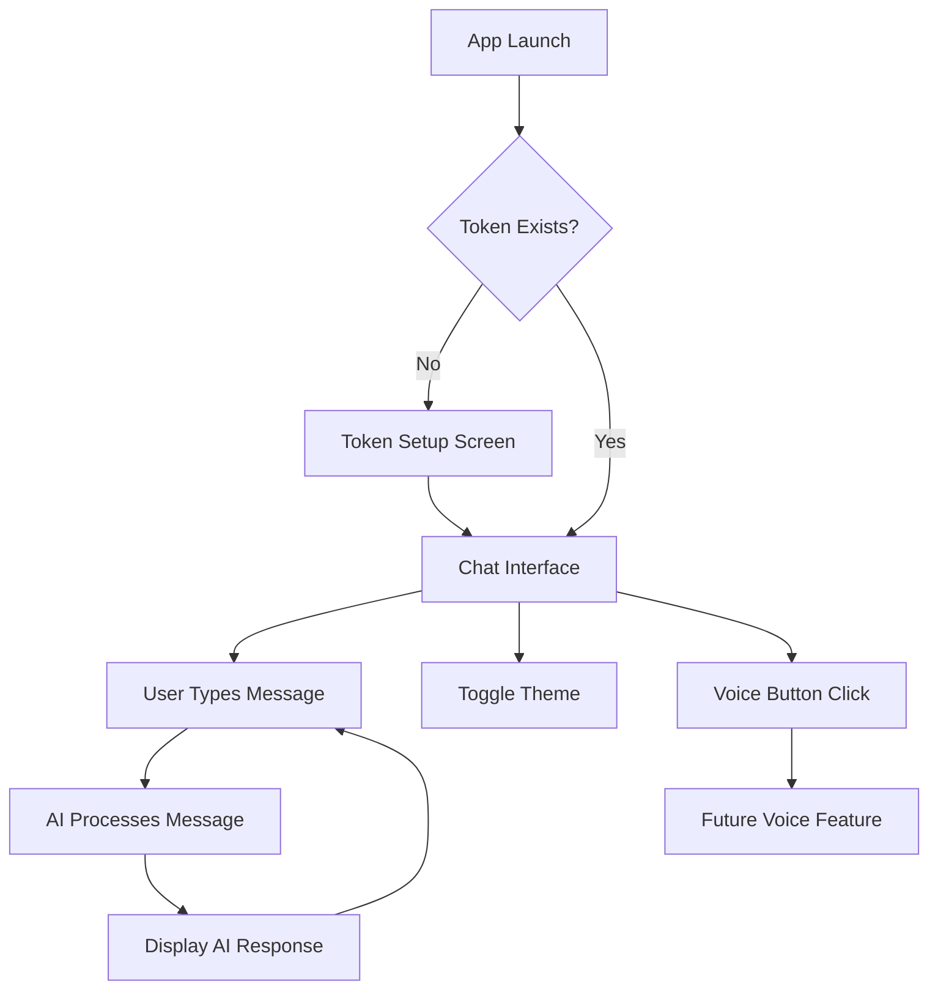

## 1. Product Overview

Resonate Coach is a Progressive Web App (PWA) that provides users with an AI-powered fitness coaching experience through an elegant chat interface. The app focuses on delivering personalized fitness guidance through natural conversation, eliminating the complexity of traditional fitness apps with a minimalist design approach.

The product solves the problem of overwhelming fitness information by providing a single, conversational interface where users can get personalized fitness advice, workout recommendations, and health guidance from an AI coach that adapts to their needs and preferences.

## 2. Core Features

### 2.1 User Roles
| Role | Registration Method | Core Permissions |
|------|---------------------|------------------|
| User | No registration required | Chat with AI coach, set preferences, view chat history |

### 2.2 Feature Module
Our fitness coach PWA consists of the following main pages:
1. **Chat Interface**: AI conversation, message input, voice note button, theme toggle
2. **Token Setup**: API key input form (appears when token not configured)
3. **Install Prompt**: PWA installation banner (browser-triggered)

### 2.3 Page Details
| Page Name | Module Name | Feature description |
|-----------|-------------|---------------------|
| Chat Interface | Message Display | Show conversation history with smooth animations, auto-scroll to latest messages |
| Chat Interface | Text Input | Expandable text field that moves up when keyboard appears, supports multiline input |
| Chat Interface | Send Button | Send messages to AI coach with loading state during processing |
| Chat Interface | Voice Button | UI button for future voice input capability (currently non-functional) |
| Chat Interface | Theme Toggle | Switch between light and dark modes (dark mode uses pure black) |
| Chat Interface | Typing Indicator | Show when AI is generating response |
| Token Setup | API Key Input | Secure input field for Google Gemini API token with validation |
| Token Setup | Save Token | Store token in browser localStorage with confirmation |
| Token Setup | Skip Setup | Allow users to explore app without token (limited functionality) |

## 3. Core Process

### User Flow
1. User opens app → Checks for API token in localStorage
2. If no token → Shows token setup screen → User enters Gemini API key → Token saved
3. User accesses chat interface → Types message → AI processes and responds
4. Messages appear with smooth animations → Conversation continues
5. User can toggle themes → Switch between light/dark modes
6. PWA installation prompt appears → User can install app on device

## 4. User Interface Design

### 4.1 Design Style
- **Primary Colors**: 
  - Light mode: White (#FFFFFF) background, Dark gray (#1A1A1A) text
  - Dark mode: Pure black (#000000) background, Light gray (#F5F5F5) text
- **Accent Colors**: Blue (#007AFF) for send button, Green (#34C759) for voice button
- **Typography**: System fonts (SF Pro Display/San Francisco), 16px base size
- **Button Style**: Rounded corners (12px radius), subtle shadows, hover effects
- **Layout**: Full-screen chat interface, messages aligned to bottom
- **Animations**: Smooth fade-in for messages, slide-up for input field

### 4.2 Page Design Overview
| Page Name | Module Name | UI Elements |
|-----------|-------------|-------------|
| Chat Interface | Message Display | Bubble-style messages with user/AI distinction, timestamps, read receipts |
| Chat Interface | Input Area | Rounded input field with send button, voice button on left, expands for multiline |
| Chat Interface | Header | Minimal header with app name and theme toggle (top-right) |
| Token Setup | Input Form | Centered card with API key input, save button, skip option |
| Token Setup | Instructions | Clear text explaining what the API key is used for |

### 4.3 Responsiveness
- **Desktop-first approach**: Optimized for desktop but fully responsive
- **Mobile adaptation**: Touch-friendly buttons, appropriate spacing
- **PWA optimization**: Native app feel on mobile devices
- **Keyboard handling**: Input field moves above virtual keyboard on mobile