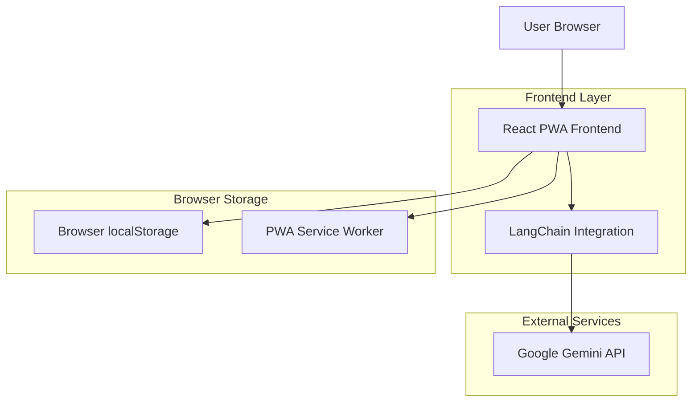
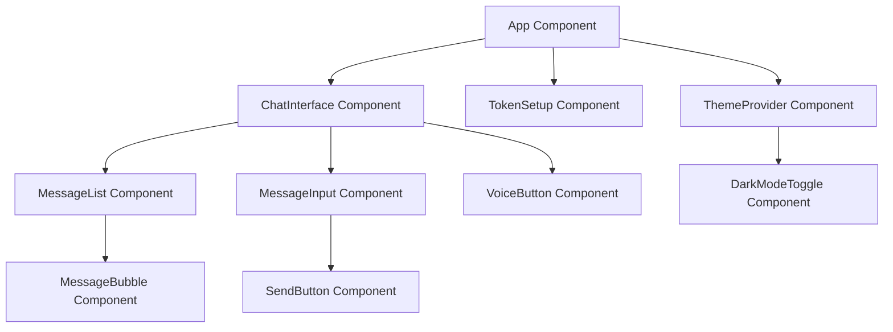

## 1. Architecture Design



## 2. Technology Description

- **Frontend**: React@18 + TypeScript + Tailwind CSS@3 + Vite
- **Initialization Tool**: vite-init
- **AI Framework**: LangChain for conversation management
- **AI Model**: Google Gemini API
- **State Management**: React Context + localStorage
- **PWA Framework**: Vite PWA Plugin
- **Backend**: None (direct API integration)

## 3. Route Definitions

| Route | Purpose |
|-------|---------|
| / | Main chat interface, displays conversation and input |
| /setup | Token configuration page for API key input |
| /install | PWA installation instructions and prompts |

## 4. API Definitions

### 4.1 Google Gemini API Integration

```typescript
interface ChatMessage {
  id: string;
  content: string;
  role: 'user' | 'assistant';
  timestamp: Date;
}

interface GeminiAPIRequest {
  prompt: string;
  context?: string;
  temperature?: number;
  maxTokens?: number;
}

interface GeminiAPIResponse {
  text: string;
  usage?: {
    promptTokens: number;
    completionTokens: number;
    totalTokens: number;
  };
}
```

### 4.2 LangChain Integration

```typescript
interface LangChainConfig {
  apiKey: string;
  modelName: string;
  temperature: number;
  maxTokens: number;
}

interface ConversationChain {
  model: any;
  memory: any;
  prompt: any;
  call(input: string): Promise<string>;
}
```

## 5. Component Architecture



## 6. Data Model

### 6.1 Browser Storage Schema

```typescript
interface AppState {
  apiToken: string | null;
  messages: ChatMessage[];
  theme: 'light' | 'dark';
  isFirstVisit: boolean;
}

interface LocalStorageKeys {
  API_TOKEN: 'resonate_coach_api_token';
  CHAT_HISTORY: 'resonate_coach_messages';
  THEME_PREFERENCE: 'resonate_coach_theme';
  FIRST_VISIT: 'resonate_coach_first_visit';
}
```

### 6.2 PWA Configuration

```json
{
  "name": "Resonate Coach",
  "short_name": "Resonate",
  "description": "AI-powered fitness coaching through natural conversation",
  "theme_color": "#000000",
  "background_color": "#000000",
  "display": "standalone",
  "orientation": "portrait",
  "scope": "/",
  "start_url": "/",
  "icons": [
    {
      "src": "/icon-192.png",
      "sizes": "192x192",
      "type": "image/png"
    },
    {
      "src": "/icon-512.png",
      "sizes": "512x512",
      "type": "image/png"
    }
  ]
}
```

## 7. State Management Architecture

### 7.1 React Context Structure

```typescript
interface AppContextType {
  // API Configuration
  apiToken: string | null;
  setApiToken: (token: string) => void;
  
  // Chat State
  messages: ChatMessage[];
  addMessage: (message: ChatMessage) => void;
  clearMessages: () => void;
  
  // UI State
  theme: 'light' | 'dark';
  toggleTheme: () => void;
  isTyping: boolean;
  setIsTyping: (typing: boolean) => void;
  
  // PWA State
  isInstallable: boolean;
  promptInstall: () => void;
}
```

### 7.2 LangChain Implementation Pattern

```typescript
class FitnessCoachChain {
  private chain: ConversationChain;
  private memory: BufferMemory;
  
  constructor(apiKey: string) {
    const model = new GoogleGemini({
      apiKey,
      modelName: "gemini-flash-latest",
      temperature: 0.7,
      maxOutputTokens: 2048,
    });
    
    this.memory = new BufferMemory({
      returnMessages: true,
    });
    
    const prompt = ChatPromptTemplate.fromMessages([
      ["system", "You are a helpful fitness coach AI assistant. Provide personalized fitness advice, workout recommendations, and health guidance."],
      ["human", "{input}"],
    ]);
    
    this.chain = new ConversationChain({
      llm: model,
      memory: this.memory,
      prompt,
    });
  }
  
  async sendMessage(message: string): Promise<string> {
    try {
      const response = await this.chain.call({ input: message });
      return response.response;
    } catch (error) {
      throw new Error("Failed to get AI response");
    }
  }
}
```

## 8. Security Considerations

### 8.1 API Token Management
- Store API tokens only in browser localStorage
- Never expose tokens in URL parameters or network requests
- Implement token validation before API calls
- Provide clear instructions for obtaining API keys

### 8.2 Content Security Policy
```html
<meta http-equiv="Content-Security-Policy" content="
  default-src 'self';
  connect-src 'self' https://generativelanguage.googleapis.com;
  script-src 'self' 'unsafe-inline';
  style-src 'self' 'unsafe-inline';
  img-src 'self' data: https:;
">
```

## 9. Performance Optimization

### 9.1 Lazy Loading Strategy
- Load LangChain libraries only when needed
- Implement code splitting for different routes
- Use React.lazy() for heavy components

### 9.2 Caching Strategy
- Cache API responses for repeated queries
- Implement service worker for offline functionality
- Use browser storage for chat history persistence
